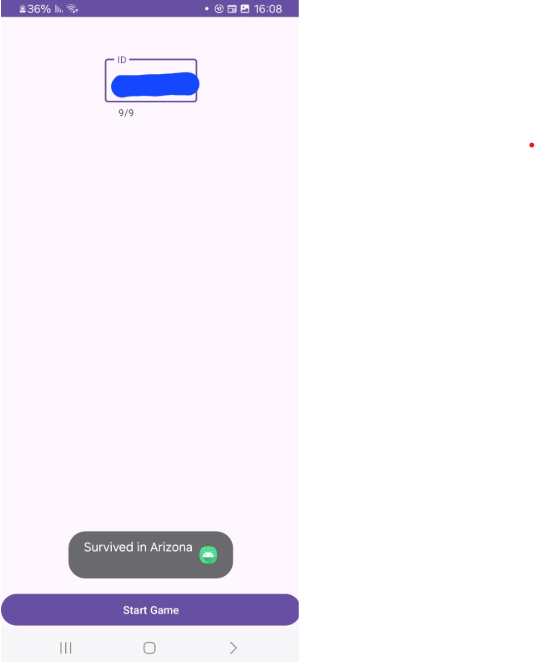

# SurviveGame HW2 – Reverse Engineering and Navigation Game

## Overview

Reverse engineer the provided APK and rebuild the app so that a user can enter their ID and follow on-screen arrows to survive and reach their city.

## Getting Started

1. **Prerequisites**
    - Android Studio
    - APK decompiler tool (e.g. jadx, APKTool)
2. **Clone & Open**
   ```bash
   git clone https://github.com/danielgerbi7/MobileSecurity_HW2.git
   ```
3. **Permissions**  
   Make sure your `AndroidManifest.xml` includes:
   ```xml
   <uses-permission android:name="android.permission.INTERNET" />
   ```
4. **Build & Run**
    - Open in Android Studio
    - Run on device or emulator

## Usage

1. Launch the app.
2. Enter your national ID (digits only).
3. Tap **Start Game**.
4. Follow the on-screen arrows (or Toasts) to “survive” and reach your city.

## Architecture & Process

1. **Decompile APK**
    - Filter only the files you need:
        - `Activity_Game.java`
        - `Activity_Menu.java`
        - Layout XMLs
        - `strings.xml`
        - Arrow PNGs
2. **Clean Up (Bugs)**
    - Remove hidden/unicode characters from URLs
    - Add missing permissions
3. **Rebuild**
    - Import into Android Studio
    - Resolve any resource or package mismatches

## Features

- Reads ID as string, iterates per digit
- Computes `digit % 4` → direction:
    - `0` → Left
    - `1` → Right
    - `2` → Up
    - `3` → Down
- Displays moves via `ImageButton` highlights or `Toast`

## How It Works

1. **Input → Parsing**: EditText → String → `char[]`
2. **Calculation**: `int direction = (digitChar - '0') % 4`
3. **Mapping** to arrow indices
4. **Display** each move in sequence

## Bug Fixes

1. **Internet Permission**  
   Added `<uses-permission android:name="android.permission.INTERNET" />`.
2. **Hidden Characters**  
   Stripped zero-width characters from URL literals to avoid silent failures.

## Screenshot

|  |
|--------------------------------------------------------------------------|

## Author

[Daniel Gerbi](https://github.com/danielgerbi7)